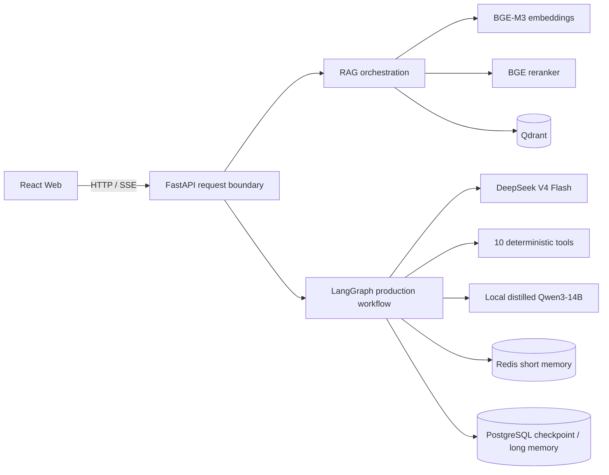
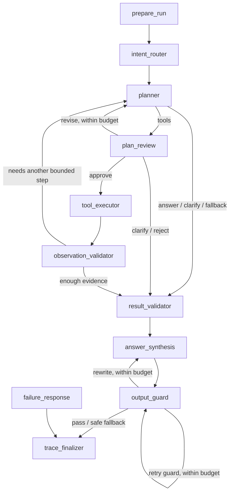
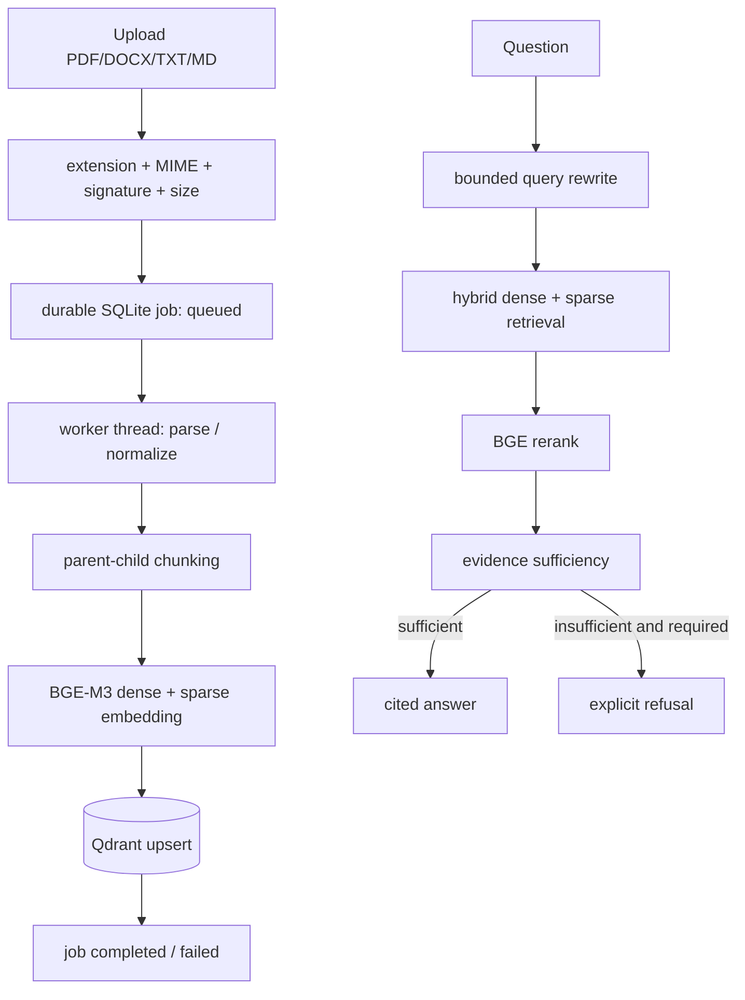

# 系统架构

本项目定位为单用户、自托管、可展示真实工程能力的中文金融 Agent。它采用“外层确定状态机、内层有限自主规划”的结构：所有主节点、跳转、预算和失败出口都由代码控制；模型只在受限节点内做意图判断、工具规划、复核和回答生成。

## 1. 运行边界

服务端在单用户模式下固定 `tenant_id=personal`、`user_id=owner`。浏览器传来的身份字段不会成为授权依据。当前部署没有登录页，这是产品范围选择，不等于多用户安全设计；若以后开放公网或增加用户，必须在请求边界增加真实认证、授权、速率限制和租户隔离测试。

## 2. 主 Agent 状态机

默认硬预算：最多 2 轮 Agent 规划、6 次工具调用、4 个并行工具、2 次计划修订、2 次答案重写，总运行时间 120 秒。预算在服务端生成，不接受客户端扩大。

职责划分：

| 层 | 职责 | 默认模型/实现 |
|---|---|---|
| 请求边界 | 大小、类型、标识符、身份、模型枚举校验 | FastAPI/Pydantic |
| 意图、规划、计划复核 | 决定是否查库、调用哪些白名单工具、是否补问 | DeepSeek V4 Flash |
| 工具执行 | 金融公式、参数校验、超时、并行、复用与审计 | 确定性 Python |
| 最终回答 | 用户每次请求可选本地蒸馏 Qwen 或 DeepSeek | `SynthesisClientProxy` |
| 输出防护 | 数值/引用/风险边界检查，有限重写，安全降级 | DeepSeek + 规则 |
| 轨迹 | 节点状态、工具名、耗时、终止原因；不保存思维链 | LangGraph/PostgreSQL |

SSE 只发送安全的状态事件与最终已通过防护的答案，不发送隐藏推理或未审核 token。

## 3. RAG 链路

上传接口立即返回 `202 + job_id`；前端轮询任务状态。任务记录持久化到 SQLite，单进程重启时未完成任务会明确标记为失败，避免永久停在 processing。解析和向量化在线程池完成，不阻塞 API 事件循环。若部署多个 API 副本，应以 Redis/Celery、Dramatiq 或云队列替换该 job store，但保持现有 HTTP 合约。

检索使用 tenant/user/knowledge-base/document 范围过滤、dense+sparse 融合、父子块映射和可选重排。`rag_mode=required` 在证据不足时拒绝脱离文档作答；引用携带文档、页码和相关度。

## 4. 十个白名单工具

所有工具在启动时显式注册并冻结；不存在 `eval`、`globals()` 或任意模块动态执行。

1. `yearly_expense_to_monthly`
2. `emergency_fund_range`
3. `life_insurance_gap`
4. `compound_interest_projection`
5. `loan_amortization_compare`
6. `cashflow_npv_irr`
7. `bond_analytics`
8. `portfolio_risk_metrics`
9. `asset_allocation_rebalance`
10. `financial_ratio_analysis`

新增分析工具使用 Pydantic 输入、Decimal 或显式数值算法、公式版本和结构化输出。模型负责选工具与解释，代码负责算数。

## 5. 数据与信任边界

- 上传文件使用随机存储名，拒绝路径穿越、扩展名/MIME/文件签名不一致和超限文件。
- API Key 只从 `.env` 读取，日志和错误响应不返回密钥、文件绝对路径或原始上游异常。
- 工具只读、幂等且受白名单、超时、次数与并发限制；本版本没有转账、下单或发送外部消息能力。
- 金融回答属于信息辅助，必须保留假设、数据时间点和风险提示，不承诺收益。
- 浏览器持久化的会话只用于单用户展示；Redis/PostgreSQL/Qdrant 才是服务端状态来源。

## 6. 可观测性与失败策略

每个请求都有清洗后的 `request_id`、结构化日志、节点轨迹、工具轨迹、耗时、模型 provider、finish reason 和安全降级原因。上游超时、协议错误、工具失败、RAG 无证据和预算耗尽都有显式出口，不进入无界自反思循环。

生产扩展建议：将 JSON 日志接入 OpenTelemetry/Sentry，添加 Prometheus 的延迟、错误率、token、RAG 命中和工具失败指标；将 SQLite job store 替换成共享队列；在开放多用户之前引入 OIDC、RBAC、审计留存和数据删除策略。

## 7. 代码组织

- `agent/app/agent_graph/`：状态、节点、边和有界运行时。
- `agent/app/tools/`：显式工具注册表、输入模型和确定性算法。
- `agent/app/rag/`：解析、切块、检索、重排、引用和异步任务。
- `agent/app/api/routes/`：经过边界校验的 HTTP/SSE 接口。
- `frontend/`：对话、知识库、模型选择、停止生成、轨迹和引用展示。
- `model/`：基座 + SFT LoRA + tokenizer + embedding patch 的自托管加载。

架构借鉴 LangGraph 的显式状态图、常见生产 RAG 的混合检索/重排/引用模式以及 OpenAI-compatible 模型接口；没有复制第三方应用源码。许可证边界见 `THIRD_PARTY_NOTICES.md`。
